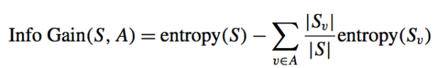
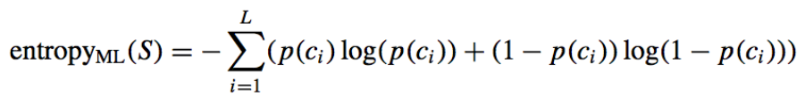

# Multi-label Hoeffding Tree
## MultiLabel_Hoeffding_Tree.classification.MultiLabelHoeffdingTree
```py
    class MultiLabel_Hoeffding_Tree.classification.MultiLabelHoeffdingTree()
```
<b>MultiLabelHoeffdingTree</b> is a class capable of performing multi-labels classification on a stream dataset.

The Hoeffding tree is the state-of-the-art classifier for single-label data streams, and performs
prediction by choosing the majority class at each leaf. Predictive accuracy can be
increased by adding naive Bayes models at the leaves of the trees. Here, we extend the
Hoeffding Tree to deal with multi-label data: a Multi-label Hoeffding Tree.

As with other classifiers, <b>MultiLabelHoeffdingTree</b> takes as input two array: an array X, sparse or dense, of size [n_samples, n_features] holding the training samples, and an array Y includes serval sub-array, and the sub-array store 1 or 0 to present yes or no:

```py
    >>> from MultiLabel_Hoeffding_Tree.classification.MultiLabelHoeffdingTree import MultiLabelHoeffdingTree
    >>> X = [[0,0,1],[1,1,1]]
    >>> Y = [[0,1],[1,1]]
    >>> clf = MultiLabelHoeffdingTree()
    >>> clf.fit(X,Y)
```
And also can use `partial_fit` to fit the stream data:

```py
    >>> from MultiLabel_Hoeffding_Tree.classification.MultiLabelHoeffdingTree import MultiLabelHoeffdingTree
    >>> X = [[0,0,1],[1,1,1]]
    >>> Y = [[0,1],[1,1]]
    >>> clf = MultiLabelHoeffdingTree()
    >>> clf.partial_fit(X,Y)
```
  <b>note</b>

  MultiLabelHoeffdingTree is only capable of binary classification (where the labels are [0,1]), because we only use 0 and 1 to present yes or no with this label.

After being fitted, the model can then be used to predict the class of samples:
```py
  clf.predict([0,1,1])
```
Using the IMDB datasets with streaming method to test the performance of MultiLabelHoeffdingTree:
```py
  from skmultiflow.evaluation.evaluate_prequential import EvaluatePrequential
  from skmultiflow.options.file_option import FileOption
  from skmultiflow.data.file_stream import FileStream
  from MultiLabel_Hoeffding_Tree.classification.MultiLabelHoeffdingTree import MultiLabelHoeffdingTree
  opt = FileOption("FILE", "OPT_NAME", "imdb.csv", "CSV", False)
  stream = FileStream(opt, 1, 27)
  stream.prepare_for_use()
  eval = EvaluatePrequential(pretrain_size=1000, output_file='result_' + dataset + '.csv', max_instances=10000, batch_size=1,n_wait=500, max_time=1000000000, task_type='multi_output', show_plot=False)
  eval.eval(stream=stream, classifier=MultiLabelHoeffdingTree())
```

## Tree algorithms: C4.5
C4.5 is the successor to ID3 and removed the restriction that features must be categorical by dynamically defining a discrete attribute (based on numerical variables) that partitions the continuous attribute value into a discrete set of intervals. C4.5 converts the trained trees (i.e. the output of the ID3 algorithm) into sets of if-then rules. These accuracy of each rule is then evaluated to determine the order in which they should be applied. Pruning is done by removing a rule’s precondition if the accuracy of the rule improves without it.
## Mathematical formulation
Information gain:
    - 

Adapted C4.5 to multi-label data classification by modifying the entropy calculation
    - 
